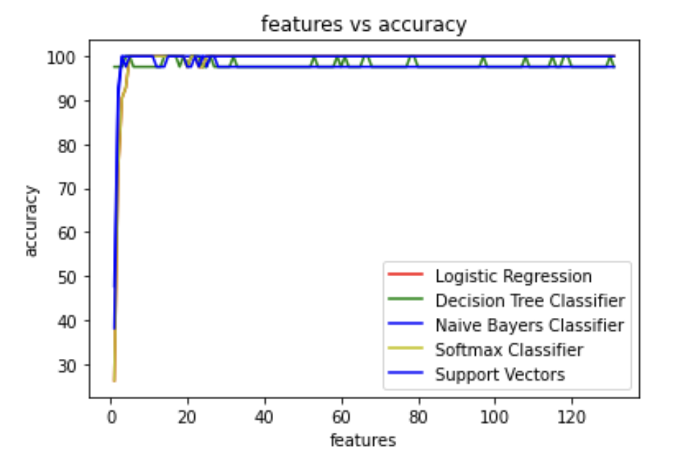
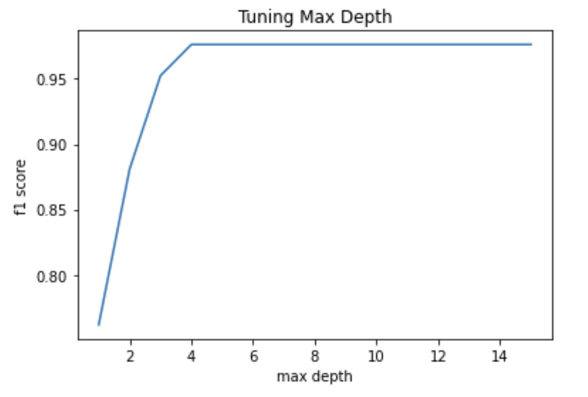
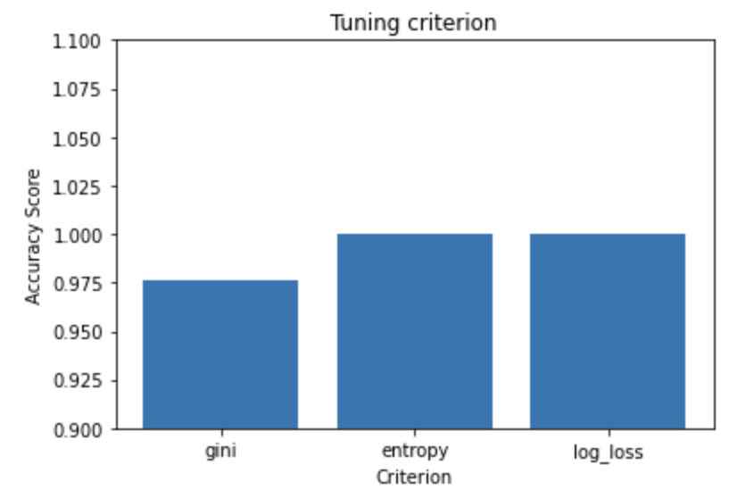
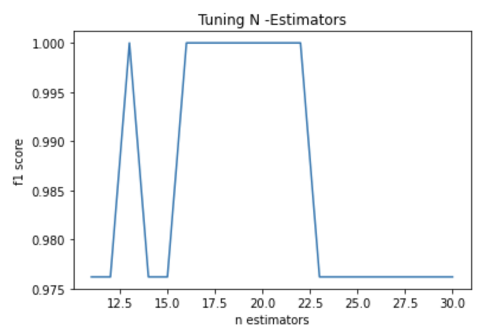
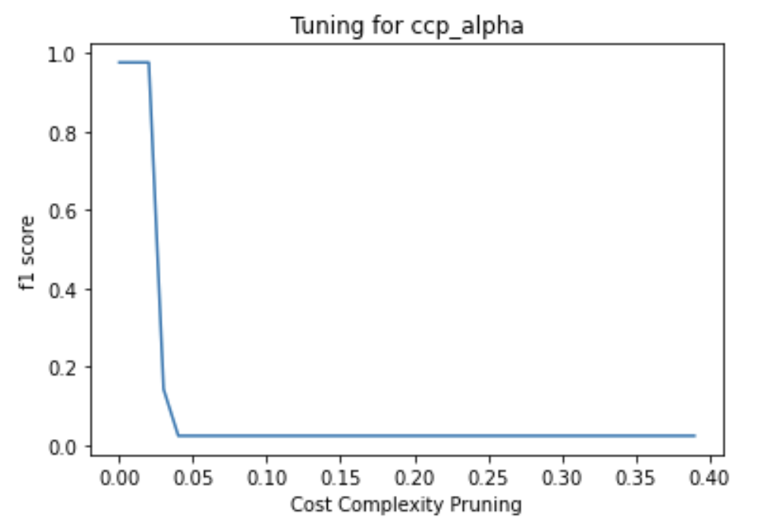
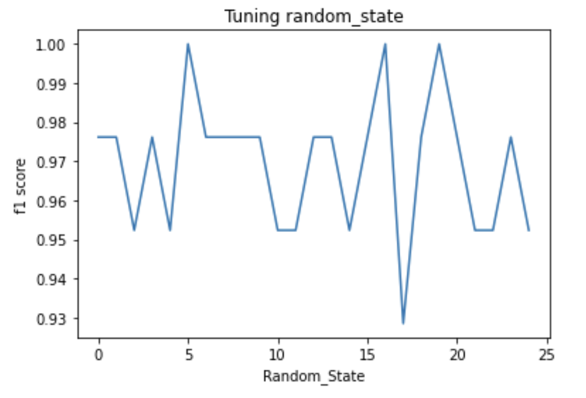

# Disease Classification

We aim at classifying diseases using various ml models and understanding their accuracy.

## Problem

*Complete Dataset consists of 2 CSV files attached in the assignment. One of them is training and other is for testing your model. Each CSV file has 133 columns. 132 of these columns are symptoms that a person experiences and last column is the prognosis. These symptoms are mapped to 42 diseases you can classify these set of symptoms to. You are required to train your model on training data and test it on testing data.*

***Objectives:*** 

- *Used any four supervised ML models and compare their performances.*
- *Apply dimensional reduction technique (PCA) on data and see how the classification accuracy decreases as the dimension is reduced. Plot a graph between classification accuracy and number of PCA features.*
- *Apply Random Forest algorithm and tune the hyper-parameters for getting the best classification accuracy.*

*You need to make a report with links to your code files and returned it to the assignment.*

## Solution

### Supervised ML models used
Below are the 5 supervised ML models that I have used :
    - Logistic Regression
    - Decision Tree Classifier
    - Naive Bayes Classifier
    - Support Vector Classifier(linear)
    - Softmax Regression (multiclass Logistic)
#### Results
Below is the accuray for each correponding model used : 

| Classification Algorithm Used |      Accuracy      |
|:-----------------------------:|:------------------:|
|   Logistic Regression         |       100.0%
|    Decision Tree Classifier   |       97.62%       |
|     Naive Bayes Classifier    |       100.0%       |
|   Support Vector Classifier   |       100.0%       |
|       Softmax Classifier      |       100.0%       |  

### Applying PCA
I applied PCA to reduce dimensions from 132 to k. Then plotted the accuracy of each model vs k.



### The next part is to apply the Random Forest Algorithm.
The initial accuracy comes out to be 97.62%
Now tuning max_depth, criterion, n_estimators and ccp_alpha.

#### Results

1. Tuning ```max_depth```

- From the graph, the optimum value is 3                    
2. Tuning ```criterion```

- Entropy and log_loss were better than gini.
3. Tuning ```n_estimators```

- Peaked at value 13 U {15 to 23} 
4. Tuning ```cp_alpha```

- Decresing graph 

#### Final Plotxs
For deterministic results , we plotted the accuracies with respect to value and chose *5* as it was one of the peaks.


#### We achieved a classification accuracy of *100%* after tuning the parameters ####